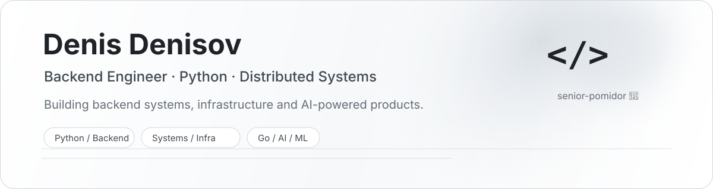

<p align="right">
  <strong>English</strong> · <a href="./README_RU.md">Русский</a>
</p>

<p align="center">
  <picture>
    <source media="(prefers-color-scheme: dark)" srcset="./assets/header-dark.svg">
    <source media="(prefers-color-scheme: light)" srcset="./assets/header-light.svg">
    
  </picture>
</p>

<p align="center">
  <strong>Senior-pomidor backend developer 🍅</strong><br/>
  Python first. Learning Go. Exploring ML, LLM systems and AI-assisted engineering.
</p>

---

## About

<table>
<tr>
<td width="50%" valign="top">

### What I build

- Backend services and APIs with **Python**
- **Async and event-driven** systems
- Data-heavy services with **PostgreSQL, Redis and queues**
- Containerized infrastructure and production tooling
- AI/ML-backed products and processing pipelines

</td>
<td width="50%" valign="top">

### Currently

- 🦫 Learning **Go** through hands-on backend projects
- 🧠 Going deeper into **ML / LLM / AI engineering**
- 🤖 Building better workflows for **AI coding agents**
- 🏗️ Interested in architecture, reliability and developer experience

</td>
</tr>
</table>

## Stack

**Backend**  


**Data & Messaging**  


**Infrastructure**  


**Engineering**  
`asyncio` · `SQLAlchemy` · `pytest` · `Git` · `CI/CD` · `REST` · `microservices` · `event-driven systems`

---

## Selected work

<table>
<tr>
<td width="50%" valign="top">

### 🧠 Verilyze
**Reputation intelligence & OSINT platform**

A large Python platform that turns raw open-source text into structured reputation analytics.

`Python` `FastAPI` `PostgreSQL` `NLP` `ML` `LLM` `CUDA`

- Multi-service ML/NLP processing pipeline
- GPU workload orchestration and VRAM-aware services
- Entity, event, relationship and reputation analysis
- LLM-generated analytical dossiers

</td>
<td width="50%" valign="top">

### 🌐 AndyNPV
**Network infrastructure & service automation**

A production service around distributed network infrastructure, subscriptions, automation and observability.

`Python` `FastAPI` `PostgreSQL` `Docker` `nginx` `Linux`

- Multi-node infrastructure and service automation
- Subscription and user-management backend
- Monitoring, operational tooling and support workflows
- Production-focused reliability and maintenance

</td>
</tr>
<tr>
<td width="50%" valign="top">

### 🤖 [ai-engineering-rules](https://github.com/andilany/ai-engineering-rules)
**Engineering rules for AI coding agents**

Versioned, project-aware rules and CLI tooling for Codex, Claude Code, Cursor, GitHub Copilot and Gemini CLI.

`Python` `CLI` `AI agents` `Developer tooling`

- Detects project stack and assembles relevant rules
- Generates native agent instructions
- Keeps project-specific guidance separate and user-owned
- Designed not to rewrite application architecture or dependencies

</td>
<td width="50%" valign="top">

### 🦫 [go-api-gateway](https://github.com/andilany/go-api-gateway)
**Learning project in Go**

HTTP API gateway with configuration API, reverse proxy and PostgreSQL request logging.

`Go` `PostgreSQL` `Reverse Proxy` `REST`

- Dynamic route configuration
- Header forwarding and sanitization
- Request logging and rate limiting
- Built as a practical Go/backend learning project

</td>
</tr>
</table>

---

## How I think about backend engineering

```text
correctness → observability → reliability → performance → scale
```

I prefer systems that are understandable in production: explicit contracts, predictable failure modes, useful logs and metrics, idempotent operations where needed, and architecture chosen for the problem rather than for fashion.

## Open source

I'm interested in **Python backend**, **developer tooling**, **AI engineering**, **distributed systems** and **infrastructure**.  
If something here is useful to you, issues, discussions and contributions are welcome.

<p align="center">
  <sub>Mostly Python. Sometimes Go. Increasingly AI. Always a little 🍅.</sub>
</p>
