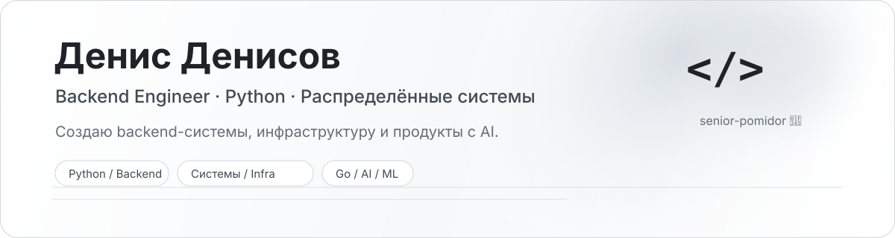

<p align="right">
  <a href="./README.md">English</a> · <strong>Русский</strong>
</p>

<p align="center">
  <picture>
    <source media="(prefers-color-scheme: dark)" srcset="./assets/header-dark-ru.svg">
    <source media="(prefers-color-scheme: light)" srcset="./assets/header-light-ru.svg">
    
  </picture>
</p>

<p align="center">
  <strong>Senior-pomidor backend developer 🍅</strong><br/>
  В основном Python. Изучаю Go. Углубляюсь в ML, LLM-системы и AI-assisted разработку.
</p>

---

## Обо мне

<table>
<tr>
<td width="50%" valign="top">

### Что я разрабатываю

- Backend-сервисы и API на **Python**
- **Асинхронные и event-driven** системы
- Data-heavy сервисы на **PostgreSQL, Redis и очередях**
- Контейнеризированную инфраструктуру и production tooling
- Продукты и пайплайны с использованием AI/ML

</td>
<td width="50%" valign="top">

### Сейчас

- 🦫 Изучаю **Go** на практических backend-проектах
- 🧠 Углубляюсь в **ML / LLM / AI engineering**
- 🤖 Развиваю инструменты и процессы для **AI coding agents**
- 🏗️ Интересуюсь архитектурой, надёжностью и developer experience

</td>
</tr>
</table>

## Стек

**Backend**  


**Данные и очереди**  


**Инфраструктура**  


**Engineering**  
`asyncio` · `SQLAlchemy` · `pytest` · `Git` · `CI/CD` · `REST` · `microservices` · `event-driven systems`

---

## Избранные проекты

<table>
<tr>
<td width="50%" valign="top">

### 🧠 Verilyze
**Платформа репутационной аналитики и OSINT**

Большая Python-платформа, которая превращает сырой текст из открытых источников в структурированную репутационную аналитику.

`Python` `FastAPI` `PostgreSQL` `NLP` `ML` `LLM` `CUDA`

- Мультисервисный ML/NLP-пайплайн обработки
- Оркестрация GPU-нагрузки и VRAM-aware сервисы
- Анализ сущностей, событий, связей и репутации
- Формирование аналитических досье с помощью LLM

</td>
<td width="50%" valign="top">

### 🌐 AndyNPV
**Сетевая инфраструктура и автоматизация сервиса**

Production-сервис вокруг распределённой сетевой инфраструктуры, подписок, автоматизации и наблюдаемости.

`Python` `FastAPI` `PostgreSQL` `Docker` `nginx` `Linux`

- Multi-node инфраструктура и автоматизация сервисов
- Backend управления пользователями и подписками
- Мониторинг, operational tooling и support workflows
- Фокус на production reliability и сопровождении

</td>
</tr>
<tr>
<td width="50%" valign="top">

### 🤖 [ai-engineering-rules](https://github.com/andilany/ai-engineering-rules)
**Инженерные правила для AI coding agents**

Версионируемые project-aware правила и CLI для Codex, Claude Code, Cursor, GitHub Copilot и Gemini CLI.

`Python` `CLI` `AI agents` `Developer tooling`

- Определяет стек проекта и собирает релевантные правила
- Генерирует native-инструкции для выбранных агентов
- Отделяет project-specific инструкции и оставляет их под контролем пользователя
- Не меняет архитектуру приложения и зависимости без решения разработчика

</td>
<td width="50%" valign="top">

### 🦫 [go-api-gateway](https://github.com/andilany/go-api-gateway)
**Учебный проект на Go**

HTTP API gateway с configuration API, reverse proxy и логированием запросов в PostgreSQL.

`Go` `PostgreSQL` `Reverse Proxy` `REST`

- Динамическая конфигурация маршрутов
- Forwarding и sanitization заголовков
- Логирование запросов и rate limiting
- Практический проект для изучения Go и backend-разработки

</td>
</tr>
</table>

---

## Как я смотрю на backend engineering

```text
correctness → observability → reliability → performance → scale
```

Мне нравятся системы, поведение которых понятно в production: явные контракты, предсказуемые сценарии отказа, полезные логи и метрики, идемпотентность там, где она нужна, и архитектура, выбранная под задачу, а не под тренд.

## Open source

Мне интересны **Python backend**, **developer tooling**, **AI engineering**, **распределённые системы** и **инфраструктура**.  
Если какой-то из проектов оказался полезен — issues, discussions и contributions приветствуются.

<p align="center">
  <sub>В основном Python. Иногда Go. Всё больше AI. И всегда немного 🍅.</sub>
</p>
